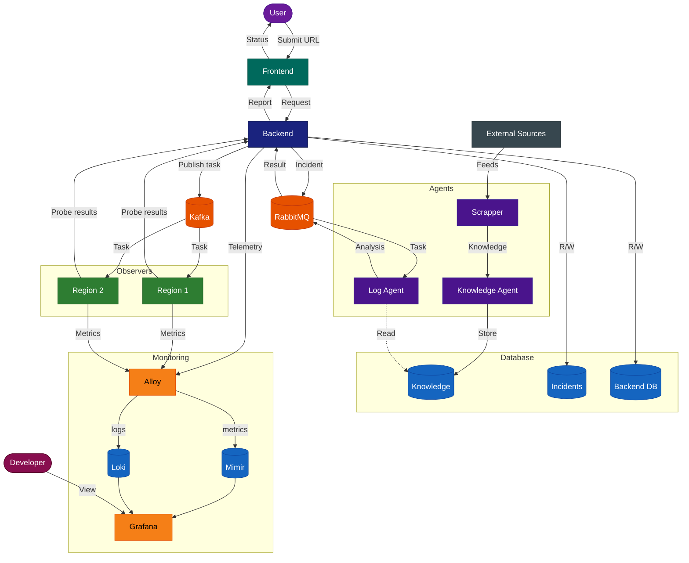

# RCAgent

Determines whether a service is unreachable due to a technical outage or censorship-based blocking, using distributed observers and AI agents.

---

### Architecture

---

### How It Works

1. **Submit** — the user enters a service URL in the web interface.
2. **Distribute** — the backend publishes a check task to Kafka; observers subscribed to the relevant channel receive it.
3. **Probe** — each observer (deployed in a different region and on a different ISP) pings the target service and collects HTTP/ICMP data.
4. **Collect** — probe results are returned to the backend.
5. **Decide** — the backend evaluates the results. If the service is inaccessible, it first attempts to classify the cause from available data alone. If the cause is inconclusive, it packages logs and metrics into an incident and publishes it to RabbitMQ.
6. **Analyze** — the Log Agent receives the incident task, reads real-time logs, and cross-references the Knowledge Agent's accumulated data (news, block lists, feed events). It returns a diagnosis.
7. **Report** — the final verdict and supporting data are delivered to the user via the frontend.

The Knowledge Agent runs continuously in the background, indexing external sources through the Scrapper and persisting structured knowledge to the database.

---

### Components

| Component | Role |
|---|---|
| **Frontend** | Web UI for submitting URLs and viewing check results and reports |
| **Backend** | Orchestrates checks, makes first-pass decisions, routes incidents to agents |
| **Kafka** | Distributes check tasks from backend to observers |
| **RabbitMQ** | Message bus between backend and the agent system |
| **Observers** | Lightweight probes in multiple regions and ISPs — perform HTTP and ICMP checks against the target |
| **Log Agent** | LLM-based agent that analyzes incident data (logs + metrics + knowledge) and determines root cause |
| **Knowledge Agent** | Passively builds a knowledge base from news, feeds, and block-list events |
| **Scrapper** | Fetches and filters content from external sources for the Knowledge Agent |
| **Database** | Stores incidents, knowledge base, and backend configuration |
| **Monitoring** | Grafana stack (Alloy + Mimir + Loki) for internal observability: server load, observer and agent availability, queue throughput, CPU/memory |
