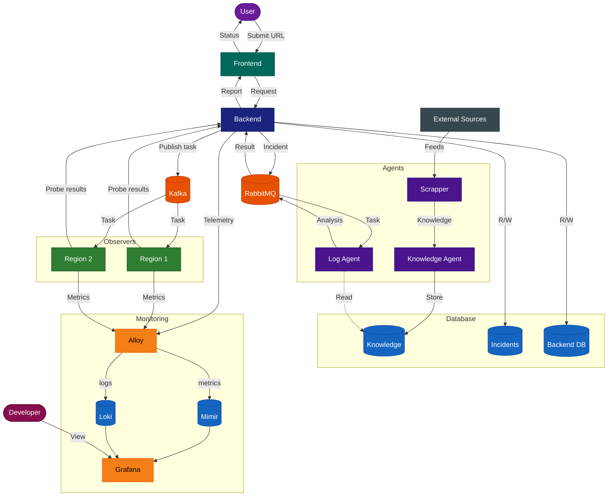

# RCAgent

Определяет, недоступен ли сервис из-за технической неисправности или из-за цензурной блокировки, используя распределённых наблюдателей и ИИ-агентов.

---

### Архитектура

---

### Как это работает

1. **Отправка** — пользователь вводит URL своего сервиса в веб-интерфейсе.
2. **Распределение** — бэкенд публикует задачу на проверку в Kafka; наблюдатели, подписанные на соответствующий канал, получают её.
3. **Проверка** — каждый наблюдатель (развёрнут в отдельном регионе у отдельного провайдера) пингует целевой сервис и собирает данные по HTTP и ICMP.
4. **Сбор** — результаты проб возвращаются на бэкенд.
5. **Решение** — бэкенд оценивает данные. Если сервис недоступен, он сначала пытается самостоятельно классифицировать причину по имеющимся данным. Если причина не очевидна — формирует инцидент (логи, метрики, результаты наблюдателей) и публикует его в RabbitMQ.
6. **Анализ** — Log Agent получает задачу, читает текущие логи и сопоставляет данные с накопленной базой знаний Knowledge Agent (новости, блок-листы, события из фидов). Возвращает диагноз.
7. **Отчёт** — итоговый вердикт и сопутствующие данные передаются пользователю через фронтенд.

Knowledge Agent работает в фоновом режиме постоянно: индексирует внешние источники через Scrapper и сохраняет структурированные знания в базу данных.

---

### Компоненты

| Компонент | Роль |
|---|---|
| **Frontend** | Веб-интерфейс для отправки URL и просмотра результатов проверок |
| **Backend** | Оркестрирует проверки, принимает первичное решение, маршрутизирует инциденты к агентам |
| **Kafka** | Распределяет задачи на проверку от бэкенда к наблюдателям |
| **RabbitMQ** | Шина сообщений между бэкендом и агентной системой |
| **Observers** | Лёгкие зонды в разных регионах и у разных провайдеров — выполняют HTTP и ICMP проверки целевого сервиса |
| **Log Agent** | LLM-агент, анализирующий данные инцидента (логи + метрики + база знаний) и определяющий первопричину |
| **Knowledge Agent** | Пассивно строит базу знаний из новостей, фидов и событий блокировок |
| **Scrapper** | Собирает и фильтрует контент из внешних источников для Knowledge Agent |
| **Database** | Хранит инциденты, базу знаний и конфигурацию бэкенда |
| **Monitoring** | Grafana-стек (Alloy + Mimir + Loki) для внутренней наблюдаемости: нагрузка на серверы, доступность наблюдателей и агентов, пропускная способность очередей, CPU/память |
