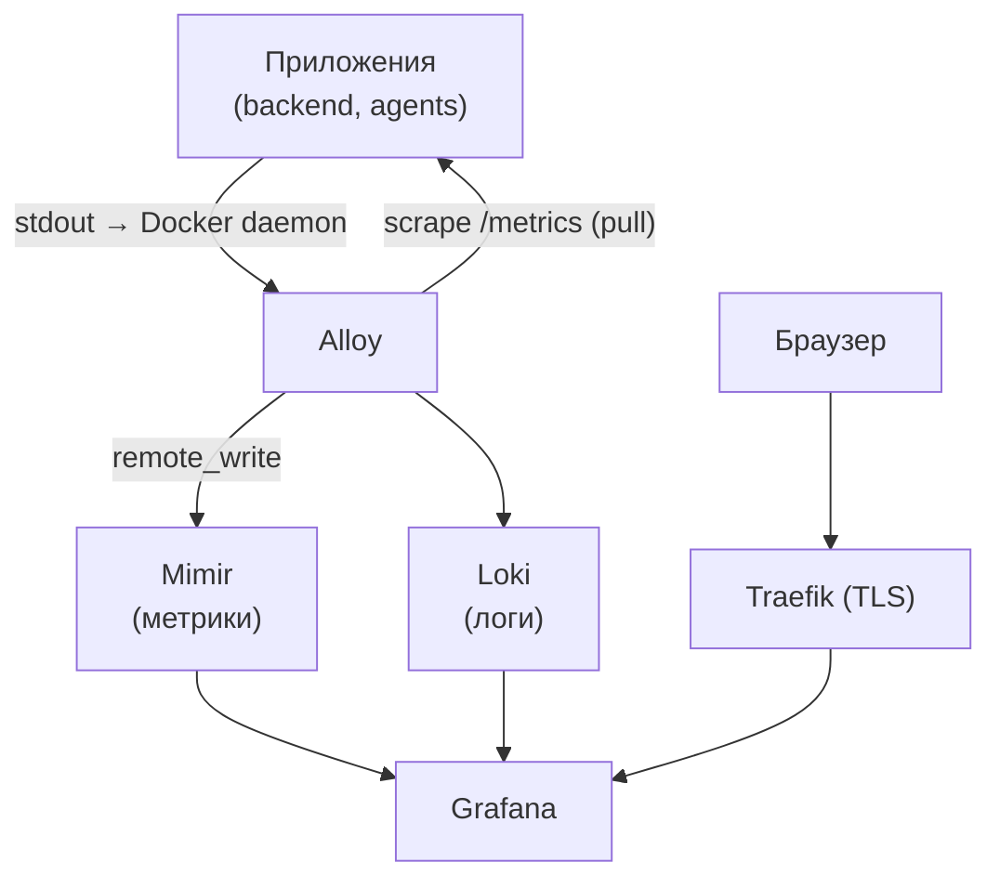
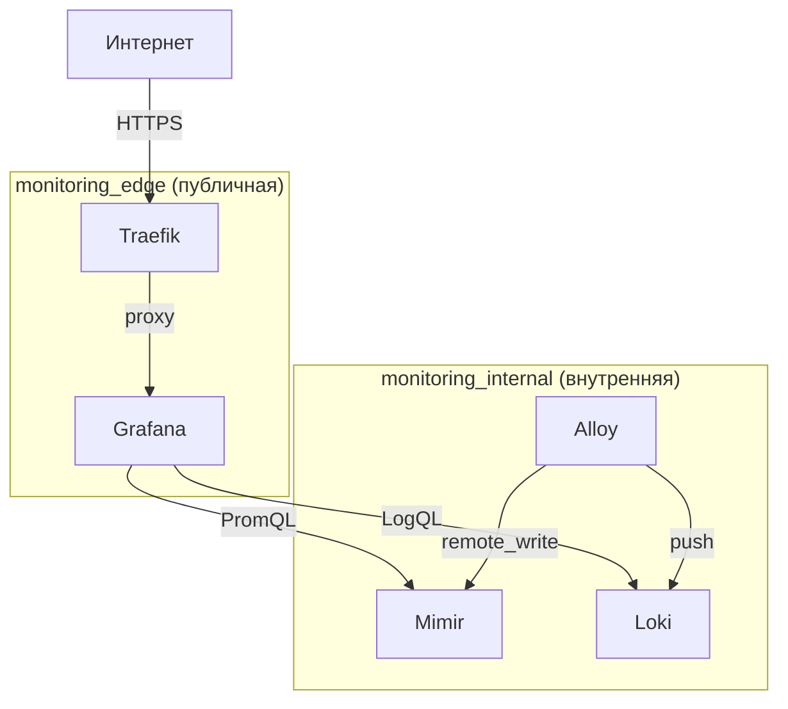

# Мониторинг

## Обзор архитектуры

Стек мониторинга состоит из пяти компонентов:

| Компонент | Образ | Назначение |
|-----------|-------|-----------|
| **Traefik** | `traefik:latest` | Reverse proxy, TLS-терминация, роутинг на Grafana |
| **Alloy** | `grafana/alloy` | Сборщик метрик и логов |
| **Mimir** | `grafana/mimir:2.14.2` | Долгосрочное хранилище метрик (Prometheus-совместимый) |
| **Loki** | `grafana/loki:2.9.8` | Хранилище логов |
| **Grafana** | `grafana/grafana:11.1.4` | Визуализация метрик и логов |

### Схема потоков данных



### Два разных потока

**Метрики — pull-модель:**
Каждый сервис экспозит HTTP-эндпоинт `/metrics` в Prometheus-формате.
Alloy сам опрашивает эти эндпоинты по расписанию (по умолчанию раз в 15 секунд).
Собранные метрики Alloy отправляет в Mimir через `remote_write`.

**Логи — push-модель через Docker:**
Сервисы пишут в stdout — это стандартная практика в контейнерах.
Alloy подключается к Docker daemon через сокет (`/var/run/docker.sock`) и читает логи всех контейнеров.
Прочитанные логи Alloy отправляет в Loki.

## Сетевая топология

В проекте две Docker-сети:



> Grafana подключена к обеим сетям — в `monitoring_edge` она принимает трафик через Traefik, в `monitoring_internal` обращается к Mimir и Loki.

**Почему две сети:**
- `monitoring_internal` — изолированная сеть для коммуникации между сервисами. Mimir и Loki не должны быть доступны напрямую снаружи.
- `monitoring_edge` — сеть, к которой подключён Traefik. Grafana в ней единственная, потому что только до неё нужно доходить из интернета.

## Компоненты

### Alloy

Центральный коллектор. Имеет две задачи:

1. **Scrape метрик** — опрашивает `/metrics` эндпоинты сервисов и пересылает в Mimir
2. **Сбор логов** — читает stdout контейнеров через Docker socket и пересылает в Loki

Конфигурируется файлом `docker/alloy/config.alloy` на языке River (синтаксис похож на HCL).

Требует доступа к Docker socket (`/var/run/docker.sock`) для чтения логов контейнеров.

### Mimir

Масштабируемое хранилище метрик, совместимое с Prometheus API. Принимает данные от Alloy через `remote_write` и предоставляет PromQL API для Grafana.

Работает в монолитном режиме (один процесс, флаг `-target=all`) — достаточно для небольшой нагрузки.

Порты:
- `9009` — HTTP API (ingestion + query)
- `9095` — gRPC (внутренняя коммуникация, в монолитном режиме не используется)

### Loki

Хранилище логов. В отличие от Elasticsearch не индексирует содержимое логов — только метки (labels). Это делает его дешёвым по ресурсам. Запросы через LogQL.

Порт `3100` — HTTP API.

### Grafana

Дашборд. Подключается к Mimir и Loki как к datasource. Конфигурация datasource'ов задаётся через provisioning — файл `docker/grafana/datasources.yaml` монтируется при старте, ручная настройка через UI не нужна.

Доступна через Traefik по домену из `GRAFANA_DOMAIN`.

### Traefik

Принимает входящий трафик, терминирует TLS (сертификаты Let's Encrypt через ACME httpChallenge) и проксирует запросы на Grafana.

Конфигурация:
- Статическая: `docker/traefik/traefik.yml`
- Динамическая (роутеры, middleware): `docker/traefik/dynamics/`
- Сертификаты: `/etc/traefik/acme.json` (персистентный volume)

## Конфигурационные файлы

```
docker/
├── docker-compose.yml          # весь стек мониторинга
├── mimir.yaml                  # конфиг Mimir
├── loki.yaml                   # конфиг Loki
├── alloy/
│   └── config.alloy            # что скрейпить и куда отправлять
├── grafana/
│   ├── datasources.yaml        # provisioning datasource'ов
│   └── dashboards/             # JSON-экспорты дашбордов
└── traefik/
    ├── traefik.yml             # static config
    └── dynamics/
        └── routers.yml         # роутеры и middleware
```

## Переменные окружения

| Переменная | Описание | Пример |
|------------|----------|--------|
| `GRAFANA_DOMAIN` | Домен для Grafana | `grafana.example.com` |
| `GRAFANA_ROOT_URL` | Полный URL Grafana (опционально) | `https://grafana.example.com/` |

## Что должен сделать бэкенд для метрик

Бэкенд должен экспозить эндпоинт `/metrics` в Prometheus-формате. В Go это делается через `prometheus/client_golang`:

```go
import "github.com/prometheus/client_golang/prometheus/promhttp"

http.Handle("/metrics", promhttp.Handler())
```

Alloy будет опрашивать этот эндпоинт. Адрес сервиса прописывается в `config.alloy`.

Логи писать в stdout — Alloy подхватит их автоматически через Docker.

## Запуск

```bash
cd docker
GRAFANA_DOMAIN=grafana.example.com docker compose up -d
```

Grafana будет доступна на `https://grafana.example.com` после получения TLS-сертификата.

Дефолтные учётные данные: `admin` / `admin` — **сменить при первом входе**.
