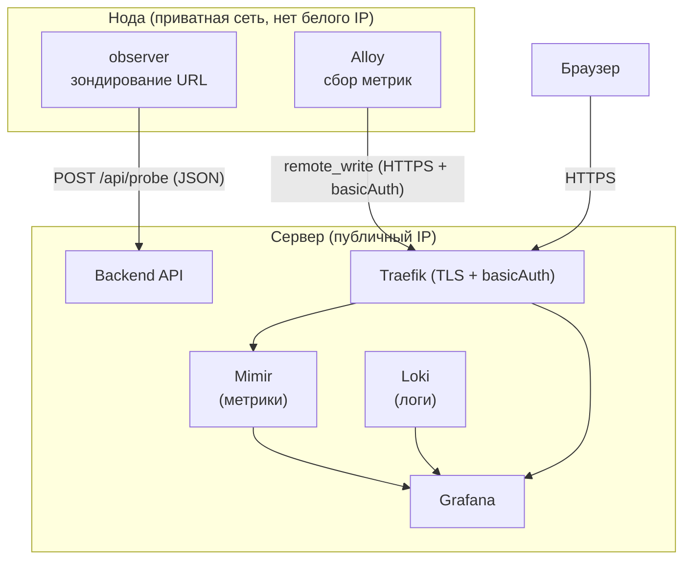
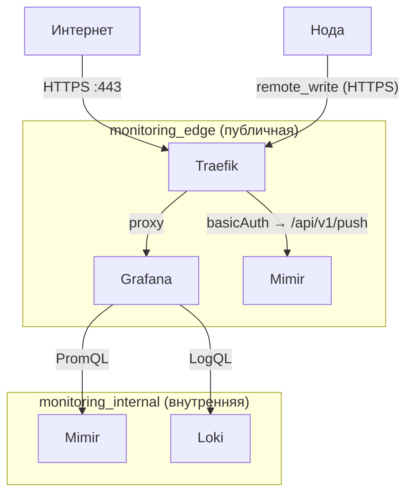

# Мониторинг

## Обзор архитектуры

Стек мониторинга состоит из двух частей: серверной (docker-compose на сервере) и нодовой (docker-compose на каждой удалённой машине).

### Серверная часть

| Компонент | Образ | Назначение |
|-----------|-------|-----------|
| **Traefik** | `traefik:latest` | Reverse proxy, TLS-терминация, роутинг и аутентификация |
| **Mimir** | `grafana/mimir:2.14.2` | Долгосрочное хранилище метрик (Prometheus-совместимый) |
| **Loki** | `grafana/loki:2.9.8` | Хранилище логов |
| **Grafana** | `grafana/grafana:11.1.4` | Визуализация метрик и логов |

### Нодовая часть (на каждой ноде)

| Компонент | Образ | Назначение |
|-----------|-------|-----------|
| **observer** | собирается из исходников | Зондирование целевого URL, отправка результатов на бекенд |
| **Alloy** | `grafana/alloy:latest` | Сбор системных метрик ноды, отправка в Mimir |

### Схема потоков данных



**Ключевой момент:** ноды не имеют белого IP и недоступны снаружи. Вся связь инициируется нодой — она первой обращается к серверу. Для метрик это push-модель через Prometheus `remote_write`.

## Сетевая топология сервера



> Mimir подключён к **обеим** сетям: через `monitoring_edge` принимает push от нод (через Traefik с basicAuth), через `monitoring_internal` отвечает на запросы Grafana. Прямые порты Mimir и Loki наружу не открыты.

**Почему две сети:**
- `monitoring_internal` — изолированная сеть для коммуникации между сервисами.
- `monitoring_edge` — публичная сеть с Traefik. Только Grafana и Mimir подключены к ней (Mimir — только для приёма метрик от нод).

## Компоненты

### Mimir

Масштабируемое хранилище метрик, совместимое с Prometheus API. Работает в монолитном режиме (`-target=all`, один процесс, `inmemory` kvstore — оптимально для одного сервера).

**Два канала доступа:**
- Снаружи (через Traefik): только эндпоинт `POST /api/v1/push` — защищён basicAuth. Ноды используют этот канал для отправки метрик.
- Внутри (через `monitoring_internal`): Grafana делает PromQL-запросы напрямую на `http://mimir:9009/prometheus`.

Конфигурация: `docker/miimir.yaml`. Данные хранятся в volume `mimir-data:/data`, retention 30 дней.

### Loki

Хранилище логов. Не индексирует содержимое — только метки (labels). Порт `3100` привязан только к `127.0.0.1` сервера (не публичный).

### Grafana

Дашборд. Подключается к Mimir и Loki как к datasource через provisioning-файл `docker/grafana/datasources.yaml`. Ручная настройка datasource через UI не нужна.

Доступна через Traefik по домену из `GRAFANA_DOMAIN`.

### Traefik

Принимает входящий трафик, терминирует TLS (Let's Encrypt через ACME httpChallenge).

Роутинг:
- `grafana.yourdomain.com` → Grafana
- `mimir.yourdomain.com/api/v1/push` → Mimir, **с basicAuth** (пароль из `MIMIR_AUTH_USERS`)

Конфигурация:
- Статическая: `docker/traefik/traefik.yml`
- Динамическая (роутеры, middleware): `docker/traefik/dynamics/` + Docker labels

### Observer (нода)

Go-бинарник, который зондирует целевой URL: DNS, TCP, TLS, HTTP/HTTPS, traceroute, throughput. Результат — JSON, отправляется на бекенд (`POST`). Запускается в цикле с интервалом `PROBE_INTERVAL`.

### Alloy (нода)

Агент сбора метрик Grafana. Запускается рядом с observer на каждой ноде. Собирает системные метрики (CPU, RAM, диск, сеть) через `prometheus.exporter.unix` и отправляет в Mimir через `remote_write` с basicAuth.

Каждая нода идентифицируется лейблами `node_id` и `region` — Grafana подхватывает их автоматически через переменные дашборда.

## Конфигурационные файлы

### Сервер

```
docker/
├── docker-compose.yml          # весь серверный стек
├── miimir.yaml                 # конфиг Mimir
├── loki.yaml                   # конфиг Loki
├── .env                        # домены, токены (не коммитить в git)
├── grafana/
│   └── datasources.yaml        # provisioning datasource'ов
└── traefik/
    ├── traefik.yml             # static config
    └── dynamics/
        └── routers.yml         # роутеры и middleware
```

### Нода (linux_binary/)

```
linux_binary/
├── docker-compose.yml          # observer + alloy
├── Dockerfile                  # сборка observer
├── entrypoint.sh               # цикл запуска observer
├── .env.example                # шаблон переменных (заполнить → .env)
└── alloy/
    └── config.alloy            # конфиг Alloy для ноды
```

## Переменные окружения

### Сервер (`docker/.env`)

| Переменная | Описание | Пример |
|------------|----------|--------|
| `GRAFANA_DOMAIN` | Домен для Grafana | `grafana.example.com` |
| `GRAFANA_ROOT_URL` | Полный URL Grafana (опционально) | `https://grafana.example.com/` |
| `MIMIR_DOMAIN` | Домен для Mimir push endpoint | `mimir.example.com` |
| `MIMIR_AUTH_USERS` | Пользователи basicAuth в htpasswd-формате | `nodes:$2y$05$...` |
| `MIMIR_PUSH_TOKEN` | Plaintext токен (копируется на ноды) | `my-secret-token` |

Сгенерировать хэш для `MIMIR_AUTH_USERS`:
```bash
docker run --rm httpd:alpine htpasswd -nbB nodes <токен>
```

### Нода (`linux_binary/.env`)

| Переменная | Описание |
|------------|----------|
| `NODE_ID` | Уникальный ID ноды (выдаётся бекендом при регистрации) |
| `NODE_REGION` | Регион, например `Moscow` |
| `NODE_ISP_NAME` | Название провайдера |
| `NODE_ISP_ASN` | AS-номер провайдера |
| `TARGET_URL` | URL для зондирования |
| `BACKEND_URL` | Эндпоинт бекенда для отправки результатов |
| `PROBE_INTERVAL` | Интервал между зондированиями в секундах (по умолчанию `60`) |
| `NODE_PUSH_URL` | URL Mimir push endpoint (`https://mimir.yourdomain.com/api/v1/push`) |
| `NODE_PUSH_TOKEN` | Токен аутентификации (значение `MIMIR_PUSH_TOKEN` с сервера) |

## Запуск

### Сервер

```bash
cd docker
# Отредактировать .env (домены, токен)
docker compose up -d
```

Grafana доступна на `https://<GRAFANA_DOMAIN>` после получения TLS-сертификата.  
Дефолтные учётные данные: `admin` / `admin` — **сменить при первом входе**.

### Нода

```bash
cd linux_binary
cp .env.example .env
# Заполнить .env: NODE_ID, TARGET_URL, BACKEND_URL, NODE_PUSH_TOKEN и т.д.
docker compose up -d --build
```

## Добавление новой ноды в Grafana

Grafana подхватывает новые ноды автоматически через переменную дашборда:

1. Создать переменную типа **Query**:
   - Data source: `Mimir`
   - Query: `label_values(up{job="node"}, node_id)`
2. На панели включить **Repeat by variable** — появится отдельная плашка на каждую ноду.

Нода считается недоступной, если метрики не поступали дольше N минут:
```promql
time() - timestamp(last_over_time(up{job="node"}[5m])) > 120
```
